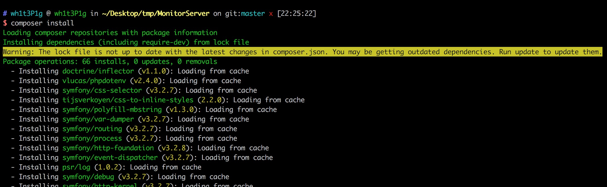
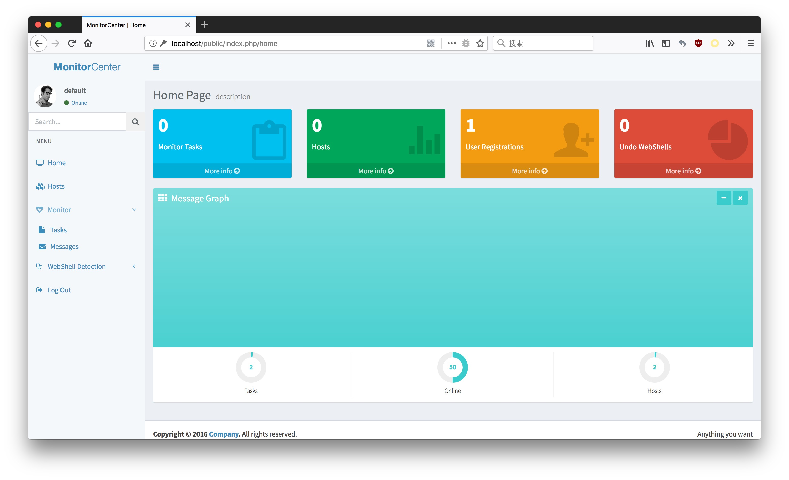

## Monitor Server
同一局域网内的网站源码监控控制端
## 运行环境
Apache2、PHP7.0.x或7.1.x

## 安装
- clone源代码到本地`git clone https://github.com/0kami/MonitorServer`
- cd到下载的目录
- `composer install` 这里需要本机上安装composer，来获取laravel的代码

- `cp .env.example .env` 复制相应.env文件，将数据库信息填写完整，并修改好相应的管理员账号密码

```
DB_CONNECTION=mysql
DB_HOST=127.0.0.1
DB_PORT=3306
DB_DATABASE=homestead #确保数据库已存在
DB_USERNAME=homestead
DB_PASSWORD=secret

ADMIN_NAME=admin #管理员昵称
ADMIN_ACCOUNT=admin@qq.com #管理元登陆账号 必须为邮箱格式
ADMIN_PASSWORD=admin #管理员密码
```

- `php artisan key:generate` 随机生成安全的key
- `php artisan migrate` 生成数据库

- 将文件拷入到运行目录下，给public目录建立虚拟目录

- 系统初次运行时会自动生成管理员账号，并生成lock文件，其中lock文件名可通过修改.env文件中LOCK_FILENAME来修改。
- `php artisan serve` 测试运行系统



